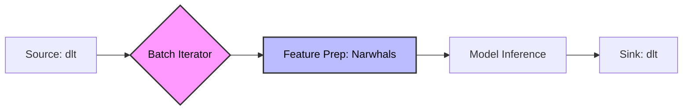

<p align="center">
  
</p>

<h1 align="center">Koala Flow</h1>

<p align="center">
  <strong>The Data-First ML Orchestration Framework for the Modern Stack.</strong>
</p>

<p align="center">
  <a href="https://pypi.org/project/koala-flow/">
    
  </a>
  <a href="https://pepy.tech/project/koala-flow">
    
  </a>
  <a href="https://github.com/godalida/koala-flow/actions">
    
  </a>
  <a href="https://opensource.org/licenses/MIT">
    
  </a>
</p>

---

**Koala Flow** is the bridge between your data warehouse and your machine learning models. It abstracts away the boilerplate of batch inference, allowing Data Engineers to deploy models with the same rigor as ETL pipelines.

Built on the shoulders of giants: **[dlt](https://dlthub.com)** for robust data loading and **[Narwhals](https://narwhals-dev.github.io/narwhals/)** for dataframe-agnostic processing (Polars, Pandas, PyArrow).

### 🚀 Why Koala Flow?

*   **Universal Ingestion:** Pull features from REST APIs, SQL databases, S3, or local files seamlessly.
*   **Lazy & Efficient:** Process 100GB+ datasets on a single machine using lazy evaluation and smart batching.
*   **Schema Evolution:** Automatically handle new model outputs or changed feature types without breaking downstream tables.
*   **Framework Agnostic:** Bring your own model (XGBoost, Scikit-Learn, PyTorch, ONNX). We just run it.

---

## 📦 Installation

Python 3.10 or greater is required.

```bash
pip install koala-flow
```

*Optional backends:*
```bash
pip install "koala-flow[polars, xgboost]"
```

## ⚡ Quick Start

Deploying a batch inference pipeline takes less than 20 lines of code.

```python
import dlt
from koala_flow import InferencePipeline
from koala_flow.adapters import XGBoostAdapter

# 1. Define your pipeline configuration
pipeline = InferencePipeline(
    name="fraud_detection_prod",
    
    # Load your trained model artifact
    model=XGBoostAdapter("s3://models/fraud_v2.json"),
    
    # Destination: Where do predictions go? (BigQuery, Snowflake, DuckDB, etc.)
    destination=dlt.destinations.bigquery(
        credentials=dlt.secrets.value,
        dataset_name="ml_predictions"
    )
)

# 2. Run it!
# Source can be ANY dlt source (SQL, API, Files)
pipeline.run(
    source=dlt.sources.sql_database("postgresql://db-prod/users"),
    table_name="scored_transactions"
)
```

## 🏗 Architecture

Koala Flow enforces a clean separation of concerns for ML in production:



1.  **Source:** `dlt` handles the extraction, ensuring state is managed (incremental loading).
2.  **Prep:** Your transformation logic runs on `Narwhals`, compatible with Pandas or Polars.
3.  **Inference:** The `ModelAdapter` handles the specific `.predict()` logic.
4.  **Sink:** `dlt` handles the loading, schema inference, and type casting.

## 🔌 Supported Adapters

| Adapter | Status | Description |
| :--- | :--- | :--- |
| `PickleAdapter` | ✅ Stable | Standard Scikit-Learn / Generic Python objects |
| `XGBoostAdapter` | ✅ Stable | Optimized DMatrix loading for XGBoost |
| `LightGBMAdapter` | 🚧 Beta | Native LightGBM support |
| `ONNXAdapter` | 🚧 Beta | High-performance inference runtime |
| `PyTorchAdapter` | 🗓 Planned | TorchScript / Eager execution |

## 🤝 Contributing

We welcome contributions! Whether it's a new model adapter, a documentation fix, or a core feature.

1.  Check the [Issues](https://github.com/koala-flow/koala-flow/issues) for help wanted.
2.  Read our [Contribution Guide](CONTRIBUTING.md).
3.  Join the [Discord Community](https://discord.gg/koala-flow).

## 📄 License

MIT © 2026 godalida - [KoalaDataLab](https://koaladatalab.com)
